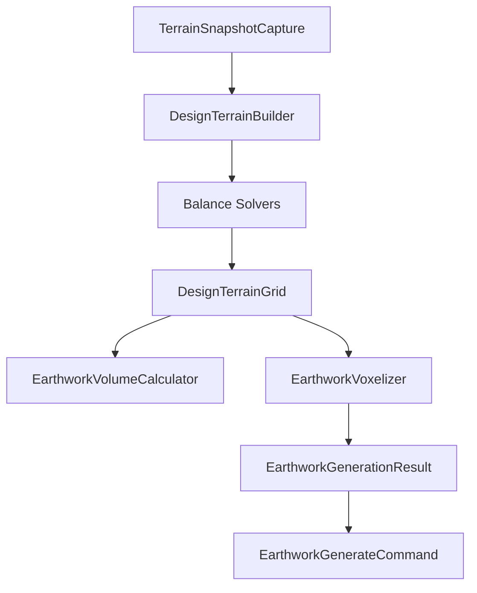

# Earthwork 2.0 核心架构

> **状态**：Phase 17 设计定稿（待分步实施）  
> **关联**：[EarthworkSite_领域设计.md](./EarthworkSite_领域设计.md)（领域模型与 JSON）、道路插件 `RoadSystemPlugin` + `manager/*` 模式

---

## 1. 为什么要改

### 1.1 现状问题

| 组件 | 行数（约） | 问题 |
|------|-----------|------|
| `EarthworkPlugin` | **2,575** | UI、World 采样、预览、构建、项目状态、画布叠加、边坡/孔洞编辑全部堆在一起 |
| `EarthworkGenerator` | **506** | 同时负责：地形读取、标高求解、土方计算、材料判断、体素生成、`BlockRecord` 产出 |
| `RoadSystemPlugin`（对照） | **204** | 只做生命周期编排；预览/持久化/工具/UI 各由 Manager 承担 |

道路插件已证明：**领域算法继续堆在主插件类里，最终一定会失控。** Earthwork 应在 2.0 阶段主动拆分，而不是等 `EarthworkPlugin` 突破 4,000 行再救火。

### 1.2 设计原则

1. **单向管线**：`Terrain → Design → Solve → Volume → Grading → Voxel`，每步输入/输出类型明确。
2. **无 World 依赖的核心**：标高求解、方量、Design Terrain 合成可在测试中脱离 `World` 运行（`TerrainSnapshot` + `BlockSampler` 已验证可行）。
3. **Plugin 薄、Manager 厚**：`EarthworkPlugin` 只编排；业务进 `earthwork.pipeline` / `earthwork.manager`。
4. **渐进迁移**：新类与旧类并存，委托链保持行为不变；每步有测试兜底。
5. **领域模型不动根**：`EarthworkSite` / `GradingZone` / `DesignSurface` 等 `model/*` 保持聚合根，2.0 拆的是**算法与编排**，不是重做 JSON。

---

## 2. 目标包结构

```
com.plot.plugin.earthwork
│
├── model/              # 已有：聚合根、策略、JSON DTO（保持）
├── persistence/        # 已有：schema 迁移（保持）
│
├── terrain/            # 现状地形
│   ├── TerrainSnapshot
│   ├── TerrainSnapshotCache
│   ├── TerrainSurfaceSampler
│   ├── TerrainBoundaryBlender
│   └── SiteTerrainCapture
│
├── design/             # 设计面解析（纯函数）
│   ├── DesignSurfaceResolver / GradingSurfaceResolver
│   ├── DesignTerrainComposer
│   ├── MultiPlaneSurfaceEvaluator / ExcavationPitSurfaceEvaluator
│   ├── RegionSurfaceEvaluator / ZoneSurfaceEvaluatorRegistry
│   └── BuildingFootprint* / RoadSurface* / RoadCorridor*
│
├── solver/             # 土方平衡求解
│   ├── EarthworkBalanceUtils
│   ├── SiteWideBalanceAdjuster / ZoneAllocationBalanceAdjuster
│   └── EarthworkAllocationMatrix
│
├── volume/             # 方量
│   ├── EarthworkVolumeCalculator
│   └── EarthworkVolumeReport / SiteEarthworkReport / EarthworkProjectReport
│
├── grading/            # 设计地形格网 + 挖填分类
│   ├── DesignTerrainGrid / DesignTerrainCell
│   ├── DesignTerrainBuilder / CutFillClassifier
│   ├── SlopeBenchProfile / GradingPlane / BreaklineClassifier
│   └── ZoneOverlapAnalyzer
│
├── geometry/           # 场地几何（无 World）
│   ├── EarthworkGeometryUtils
│   ├── ZoneBoundarySlopeApplicator
│   └── ZoneBoundaryRetainingEdgeAdapter / RetainingEdgeBreaklineAdapter
│
├── voxel/              # 体素落地
│   ├── EarthworkVoxelizer
│   └── RetainingWallGenerator
│
├── pipeline/           # 管线编排
│   └── SiteEarthworkPipeline / EarthworkPipelines / …
│
├── ui/                 # ImGui 各 Panel + EarthworkUiContext
│
└── manager/            # 插件侧编排（对标 road.manager）
    ├── EarthworkProjectManager      ← 加载/保存/历史/activeSite
    ├── EarthworkPreviewManager      ← 预览生成、虚影、lastGenerationResult
    ├── EarthworkBuildManager        ← executeScheduled、取消、appliedRecords
    ├── EarthworkTerrainManager      ← captureFresh、snapshot 缓存、过期检测
    └── EarthworkUIManager           ← ImGui 各 Tab；从 EarthworkPlugin 迁出
```

**插件层**（`EarthworkPlugin`，目标 < 300 行）：

```
EarthworkPlugin
  ├─ onEnable / onDisable / 事件订阅
  ├─ 持有 manager/*
  └─ renderExtensionPanel() → uiManager.render()
```

---

## 3. 管线数据流



| 阶段 | 输入 | 输出 | 现有实现 |
|------|------|------|----------|
| **Capture** | `World` + 红线/分区轮廓 | `TerrainSnapshot` | `TerrainSnapshot.capture` |
| **Compose** | `EarthworkSite` + `TerrainSnapshot` | `DesignTerrainGrid` | `DesignTerrainComposer.compose` |
| **Balance** | `DesignTerrainGrid` + `CompositionPolicy` | 调整后的 grid / ΔY 报告 | `SiteWideBalanceAdjuster`、`ZoneAllocationBalanceAdjuster` |
| **Volume** | grid + 材料模型 | `EarthworkVolumeReport` | 散落在 `EarthworkGenerator.computeEarthworkFromDesignGrid` |
| **Voxelize** | grid + `BlockSampler` | `BlockRecord` 集 | `EarthworkGenerator.applyColumnEarthwork` |
| **Apply** | `BlockRecord` | World 方块 | `EarthworkGenerateCommand`（core.command，保持） |

---

## 4. 现有类 → 2.0 映射

### 4.1 已有、基本就位

| 现有类 | 2.0 归属 | 备注 |
|--------|----------|------|
| `TerrainSnapshot` | `terrain/` | 已是核心抽象 |
| `TerrainSnapshotCache` | `terrain/` | |
| `TerrainSurfaceSampler` | `terrain/` | 可重命名为 `EngineeringTerrainSampler` |
| `DesignTerrainComposer` | `design/` | 场地合成 |
| `DesignSurfaceResolver` / `GradingSurfaceResolver` | `design/` | 单分区平面解析 |
| `MultiPlaneSurfaceEvaluator` | `design/` | |
| `ExcavationPitSurfaceEvaluator` | `design/` | |
| `EarthworkBalanceUtils` | `solver/BalanceElevationSolver` | 纯函数，几乎可直接改名 |
| `SiteWideBalanceAdjuster` | `solver/BalanceOffsetSolver` | |
| `ZoneAllocationBalanceAdjuster` | `solver/ZoneAllocationSolver` | |
| `EarthworkVolumeReport` | `volume/` | |
| `SiteEarthworkReport` | `volume/` | |
| `ZoneBoundarySlopeApplicator` | `geometry/EdgeTreatmentApplicator` | |
| `PolygonRegionUtils` | `core.geometry`（保持）| `RegionRasterizer` 委托之 |
| `EarthworkProject` / `EarthworkSite` | `model/` + `persistence/` | 不动 |

### 4.2 需要拆分

| 现有类 | 拆出目标 |
|--------|----------|
| `EarthworkGenerator` | → `pipeline/*` + `volume/EarthworkVolumeCalculator` + `voxel/EarthworkVoxelizer` |
| `EarthworkPlugin` | → `manager/*` + `ui/*` |
| `GradingSurfaceResolver` | 并入 `design/*Evaluator`（与 `DesignSurfaceResolver` 统一） |
| `RetainingWallGenerator` | → `voxel/RetainingWallVoxelizer` |

### 4.3 尚未存在、需新建

| 2.0 类 | 职责 |
|--------|------|
| `SiteEarthworkPipeline` | 编排六阶段；`generateSite()` 唯一入口 |
| `EarthworkVolumeCalculator` | 对 `DesignTerrainGrid` 或列列表做几何方量 + 材料换算 |
| `CutFillClassifier` | `(groundY, targetY) → ChangeType` |
| `EarthworkVoxelizer` | 列 → `BlockRecord`；支持 `BlockSampler` |
| `EarthworkPreviewManager` | 预览/虚影/lastResult（对标 `RoadPreviewManager`） |
| `EarthworkBuildManager` | 落地/取消/undo 入栈 |
| `EarthworkUIManager` | 全部 ImGui Tab |

---

## 5. `EarthworkGenerator` 拆解对照

当前 `EarthworkGenerator` 方法职责：

| 方法 | 2.0 归属 |
|------|----------|
| `captureExistingTerrain` / `captureSiteTerrain` | `terrain/TerrainSnapshot` + `EarthworkTerrainManager` |
| `solveDesignSurface` | `design/*Evaluator` |
| `DesignTerrainComposer.compose`（site 路径） | `grading/DesignTerrainBuilder` |
| `SiteWideBalanceAdjuster` / `ZoneAllocationBalanceAdjuster` | `solver/*` |
| `computeEarthworkFromPlane` / `computeEarthworkFromDesignGrid` | `volume/EarthworkVolumeCalculator` + `voxel/EarthworkVoxelizer` |
| `applyColumnEarthwork` | `voxel/EarthworkVoxelizer` |
| `generate` / `generateSite` 编排 | `pipeline/SiteEarthworkPipeline` |
| `EarthworkGenerationResult` | `voxel/EarthworkGenerationResult` |

拆解后 `EarthworkGenerator` 变为**薄委托壳**（ `@Deprecated` 一版后删除）：

```java
@Deprecated
public final class EarthworkGenerator {
    private final SiteEarthworkPipeline pipeline;
    // generateSite → pipeline.execute(context)
}
```

---

## 6. 插件层对标道路

| 道路 | 土方 2.0（目标） |
|------|------------------|
| `RoadSystemPlugin` (204 行) | `EarthworkPlugin` (< 300 行) |
| `RoadProjectStatus` | `EarthworkProjectStatus` |
| `RoadNetworkManager` | `EarthworkProjectManager` |
| `RoadPersistenceManager` | （可合并进 ProjectManager） |
| `RoadPreviewManager` | `EarthworkPreviewManager` |
| `RoadUIManager` | `EarthworkUIManager` |
| `RoadToolManager` | `EarthworkToolManager`（选区/三点拾取） |
| `RoadNetworkGenerator` | `SiteEarthworkPipeline` |

`EarthworkPlugin` 当前承担的职责应迁移：

| 职责 | 迁往 |
|------|------|
| ImGui 各 Tab 渲染 | `EarthworkUIManager` |
| `TerrainSnapshot` 捕获/缓存/失效 | `EarthworkTerrainManager` |
| 预览生成 + 虚影叠加 | `EarthworkPreviewManager` |
| 构建/取消/`pushExecuted` | `EarthworkBuildManager` |
| 项目加载/保存/历史 | `EarthworkProjectManager` |
| 画布叠加 renderers | 保留注册在 Plugin，或 `EarthworkOverlayRegistry` |

---

## 7. 分阶段实施（Phase 17）

**原则**：每步可合并、可测、行为不变。不一次性改包名 + 拆 Plugin。

### 17a — 管线入口（P0）

- [x] 新建 `pipeline/SiteEarthworkPipeline` + `EarthworkPipelineContext`
- [x] `EarthworkGenerator.generateSite` 委托 pipeline（内部仍调现有方法）
- [x] 测试：`SiteEarthworkPipelineTest` + `EarthworkPipelineE2ETest` / `EarthworkAnalyticalBenchmarkTest` 全绿

### 17b — 方量与体素分离（P0）

- [x] 抽出 `volume/EarthworkVolumeCalculator`
- [x] 抽出 `voxel/EarthworkVoxelizer` + `grading/CutFillClassifier`
- [x] `EarthworkGenerator` 仅编排调用；`shouldApplyBlockChange` 委托 Voxelizer

### 17c — 设计面 Evaluator 整理（P1）

- [x] `GradingSurfaceResolver` → `design/RegionSurfaceEvaluator` 门面；`design/ZoneSurfaceEvaluatorRegistry` 分区求值
- [x] `grading/DesignTerrainBuilder` 包装 `DesignTerrainComposer` + balance（Composer 内 `applySiteBalance`）
- [x] `terrain/SiteTerrainCapture` 捕获现状；`pipeline/DefaultSiteEarthworkOperations` 脱离 Generator 内部类
- [x] `pipeline/LegacyRegionPipeline` 承载单分区 `generate(region)` 逻辑

### 17d — Manager 层（P1）

- [x] `EarthworkPreviewManager` + `EarthworkBuildManager`（`manager/` 包）
- [x] `EarthworkPlugin` 预览/构建/失效路径改调 Manager（移除 ~170 行重复逻辑）
- [ ] Plugin 行数目标：< 1,500（当前 ~2,400；UI 迁出见 17e）

### 17e — UI 迁出（P2）

- [x] `earthwork/ui/EarthworkUiContext` + `manager/EarthworkUIManager` 承接全部 Tab / 工具栏 / 弹窗
- [x] `EarthworkPlugin` 仅生命周期、持久化、画布叠加（~260 行）
- [x] `earthwork/ui/*Panel` 拆分（对标道路 `Road*Panel`：`EarthworkToolbarPanel`、`EarthworkOverviewPanel`、`EarthworkAdoptPanel`、`EarthworkEditPanel`、`EarthworkGeneratePanel`；共享 `EarthworkUiWidgets` / `EarthworkUiLookups`）

### 17f — 弃用旧入口（P2）

- [x] `EarthworkGenerator` 标记 `@Deprecated`，委托 `EarthworkPipelines`
- [x] `EarthworkGenerationResult` 迁至 `pipeline/` 包
- [x] `EarthworkPipelines` 作为 2.0 推荐工厂；`EarthworkPlugin` / `EarthworkPreviewManager` 已改调管线
- [x] 包路径迁移（`terrain/`、`design/`、`solver/`、`volume/`、`grading/`、`geometry/`、`voxel/`）

---

## 8. 测试策略

| 层级 | 测试类型 | 已有 |
|------|----------|------|
| `solver/` | 单元：手算平衡标高 | `EarthworkBalanceUtilsTest` |
| `design/` | 单元：平面过控制点 | `GradingSurfaceResolverTest` |
| `grading/` | 集成：多 Zone 合成 | `DesignTerrainComposerTest` |
| `volume/` | 解析解基准 | `EarthworkAnalyticalBenchmarkTest` |
| `pipeline/` | E2E apply/undo | `EarthworkPipelineE2ETest` |
| `pipeline/` | 管线工厂 | `SiteEarthworkPipelineTest` |
| `manager/` | 预览失效 / 无预览构建 | `EarthworkManagerTest` |
| `voxel/` | 列挖填 + BlockSampler | `EarthworkGeneratorTest`（迁移后改名） |

**规则**：新类必须从第一天起可在 `world == null` + `TerrainSnapshot` 下测试。

---

## 9. 非目标（2.0 不做）

- 不重写 `EarthworkSite` 领域模型或 JSON schema（v3 已稳定）
- 不引入 Spring/Guice；Manager 由 `EarthworkPlugin.onEnable` 手动组装
- 不改变 `EarthworkGenerateCommand` / `BlockPlacementScheduler` 契约
- 不在 2.0 首波实现 `EarthworkOptimizationSolver`（仅预留接口）

---

## 10. 与领域设计文档的关系

| 文档 | 内容 |
|------|------|
| `EarthworkSite_领域设计.md` | **What**：Site / Zone / DesignSurface / 合成规则 / JSON |
| `Earthwork_2.0_架构.md`（本文） | **How**：包结构、管线、Plugin 瘦身、迁移步骤 |

领域设计 §8「管线集成」中的 `SiteEarthworkPipeline` 将在 Phase 17a 落地为真实类。

---

*维护：Phase 17 实施时同步勾选 §7 清单，并在 `EarthworkSite_领域设计.md` §10 更新状态。*
