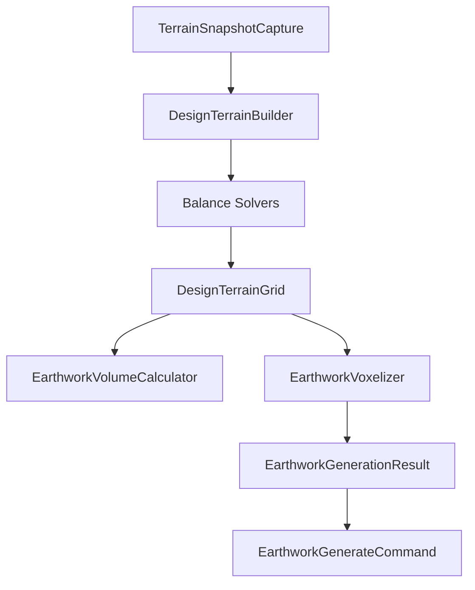

# Earthwork 2.0 核心架构

> **状态**：Phase 17 设计定稿（待分步实施）  
> **关联**：[EarthworkSite_领域设计.md](./EarthworkSite_领域设计.md)（领域模型与 JSON）、道路插件 `RoadSystemPlugin` + `manager/*` 模式

---

## 1. 为什么要改

### 1.1 现状问题

| 组件 | 行数（约） | 问题 |
|------|-----------|------|
| `EarthworkPlugin` | **2,575** | UI、World 采样、预览、构建、项目状态、画布叠加、边坡/孔洞编辑全部堆在一起 |
| `EarthworkGenerator` | **506** | 同时负责：地形读取、标高求解、土方计算、材料判断、体素生成、`BlockRecord` 产出 |
| `RoadSystemPlugin`（对照） | **204** | 只做生命周期编排；预览/持久化/工具/UI 各由 Manager 承担 |

道路插件已证明：**领域算法继续堆在主插件类里，最终一定会失控。** Earthwork 应在 2.0 阶段主动拆分，而不是等 `EarthworkPlugin` 突破 4,000 行再救火。

### 1.2 设计原则

1. **单向管线**：`Terrain → Design → Solve → Volume → Grading → Voxel`，每步输入/输出类型明确。
2. **无 World 依赖的核心**：标高求解、方量、Design Terrain 合成可在测试中脱离 `World` 运行（`TerrainSnapshot` + `BlockSampler` 已验证可行）。
3. **Plugin 薄、Manager 厚**：`EarthworkPlugin` 只编排；业务进 `earthwork.pipeline` / `earthwork.manager`。
4. **渐进迁移**：新类与旧类并存，委托链保持行为不变；每步有测试兜底。
5. **领域模型不动根**：`EarthworkSite` / `GradingZone` / `DesignSurface` 等 `model/*` 保持聚合根，2.0 拆的是**算法与编排**，不是重做 JSON。

---

## 2. 目标包结构

```
com.plot.plugin.earthwork
│
├── model/              # 已有：聚合根、策略、JSON DTO（保持）
├── persistence/        # 已有：schema 迁移（保持）
│
├── terrain/            # 现状地形
│   ├── TerrainSnapshot
│   ├── TerrainSnapshotCache
│   ├── TerrainSurfaceSampler
│   ├── TerrainBoundaryBlender
│   └── SiteTerrainCapture
│
├── design/             # 设计面解析（纯函数）
│   ├── DesignSurfaceResolver → ResolvedDesignSurface
│   ├── ResolvedDesignSurface / ResolvedDesignSource / ResolutionResult
│   ├── DesignTerrainComposer
│   ├── MultiPlaneSurfaceEvaluator / ExcavationPitSurfaceEvaluator
│   ├── RegionSurfaceEvaluator / ZoneSurfaceEvaluatorRegistry
│   └── BuildingFootprint* / RoadSurface* / RoadCorridor*
│
├── solver/             # 土方平衡求解
│   ├── EarthworkBalanceUtils
│   ├── SiteWideBalanceAdjuster / EarthworkOptimizationSolver / ProjectGlobalBalanceAggregator
│   └── EarthworkAllocationMatrix（Mode A 报告，不改标高）
│
├── volume/             # 方量
│   ├── EarthworkVolumeCalculator
│   └── EarthworkVolumeReport / SiteEarthworkReport / EarthworkProjectReport
│
├── grading/            # 设计地形格网 + 挖填分类
│   ├── DesignTerrainGrid / DesignTerrainCell
│   ├── DesignTerrainBuilder / CutFillClassifier
│   ├── SlopeBenchProfile / SlopeDaylightSolver / GradingPlane / BreaklineClassifier
│   └── ZoneOverlapAnalyzer
│
├── geometry/           # 场地几何（无 World）
│   ├── EarthworkGeometryUtils
│   ├── ZoneBoundarySlopeApplicator
│   └── ZoneBoundaryRetainingEdgeAdapter / RetainingEdgeBreaklineAdapter
│
├── voxel/              # 体素落地
│   ├── EarthworkVoxelizer
│   └── RetainingWallGenerator
│
├── pipeline/           # 管线编排
│   └── SiteEarthworkPipeline / EarthworkPipelines / …
│
├── ui/                 # ImGui 各 Panel + EarthworkUiContext
│
└── manager/            # 插件侧编排（对标 road.manager）
    ├── EarthworkProjectManager      ← 加载/保存/历史/activeSite
    ├── EarthworkPreviewManager      ← 预览生成、虚影、lastGenerationResult
    ├── EarthworkBuildManager        ← executeScheduled、取消、appliedRecords
    ├── EarthworkTerrainManager      ← captureFresh、snapshot 缓存、过期检测
    └── EarthworkUIManager           ← ImGui 各 Tab；从 EarthworkPlugin 迁出
```

**插件层**（`EarthworkPlugin`，目标 < 300 行）：

```
EarthworkPlugin
  ├─ onEnable / onDisable / 事件订阅
  ├─ 持有 manager/*
  └─ renderExtensionPanel() → uiManager.render()
```

---

## 3. 管线数据流



| 阶段 | 输入 | 输出 | 现有实现 |
|------|------|------|----------|
| **Capture** | `World` + 红线/分区轮廓 | `TerrainSnapshot` | `TerrainSnapshot.capture` |
| **Compose** | `EarthworkSite` + `TerrainSnapshot` | `DesignTerrainGrid` + `ResolvedDesignSurface` | `DesignSurfaceResolver` → `DesignTerrainComposer` |
| **Balance** | `DesignTerrainGrid` + `ResolvedDesignSurface` + `CompositionPolicy` | 调整后的 grid / ΔY 报告 | `SiteWideBalanceAdjuster`、`EarthworkOptimizationSolver`（按 `isSolverVariable`） |
| **Volume** | grid + 材料模型 | `EarthworkVolumeReport` | 散落在 `EarthworkGenerator.computeEarthworkFromDesignGrid` |
| **Voxelize** | grid + `BlockSampler` | `BlockRecord` 集 | `EarthworkGenerator.applyColumnEarthwork` |
| **Apply** | `BlockRecord` | World 方块 | `EarthworkGenerateCommand`（core.command，保持） |

---

## 4. 现有类 → 2.0 映射

### 4.1 已有、基本就位

| 现有类 | 2.0 归属 | 备注 |
|--------|----------|------|
| `TerrainSnapshot` | `terrain/` | 已是核心抽象 |
| `TerrainSnapshotCache` | `terrain/` | |
| `TerrainSurfaceSampler` | `terrain/` | 已迁至 `core/terrain/EngineeringTerrainSampler` |
| `DesignTerrainComposer` | `design/` | 场地合成 |
| `DesignSurfaceResolver` / `GradingSurfaceResolver` | `design/` | 产出 `ResolvedDesignSurface` |
| `ResolvedDesignSurface` / `ResolvedDesignSource` | `design/` | 运行时设计面：求值 + source/status/policy |
| `MultiPlaneSurfaceEvaluator` | `design/` | |
| `ExcavationPitSurfaceEvaluator` | `design/` | |
| `EarthworkBalanceUtils` | `solver/BalanceElevationSolver` | 纯函数，几乎可直接改名 |
| `SiteWideBalanceAdjuster` | `solver/BalanceOffsetSolver` | |
| `ZoneAllocationBalanceAdjuster` | `solver/EarthworkOptimizationSolver`（弃用门面） | |
| `EarthworkVolumeReport` | `volume/` | |
| `SiteEarthworkReport` | `volume/` | |
| `ZoneBoundarySlopeApplicator` | `geometry/EdgeTreatmentApplicator` | |
| `PolygonRegionUtils` | `core.geometry`（保持）| `RegionRasterizer` 委托之 |
| `EarthworkProject` / `EarthworkSite` | `model/` + `persistence/` | 不动 |

### 4.2 需要拆分

| 现有类 | 拆出目标 |
|--------|----------|
| `EarthworkGenerator` | → `pipeline/*` + `volume/EarthworkVolumeCalculator` + `voxel/EarthworkVoxelizer` |
| `EarthworkPlugin` | → `manager/*` + `ui/*` |
| `GradingSurfaceResolver` | 并入 `design/*Evaluator`（与 `DesignSurfaceResolver` 统一） |
| `RetainingWallGenerator` | → `voxel/RetainingWallVoxelizer` |

### 4.3 尚未存在、需新建

| 2.0 类 | 职责 |
|--------|------|
| `SiteEarthworkPipeline` | 编排六阶段；`generateSite()` 唯一入口 |
| `EarthworkVolumeCalculator` | 对 `DesignTerrainGrid` 或列列表做几何方量 + 材料换算 |
| `CutFillClassifier` | `(groundY, targetY) → ChangeType` |
| `EarthworkVoxelizer` | 列 → `BlockRecord`；支持 `BlockSampler` |
| `EarthworkPreviewManager` | 预览/虚影/lastResult（对标 `RoadPreviewManager`） |
| `EarthworkBuildManager` | 落地/取消/undo 入栈 |
| `EarthworkUIManager` | 全部 ImGui Tab |

---

## 5. `EarthworkGenerator` 拆解对照

当前 `EarthworkGenerator` 方法职责：

| 方法 | 2.0 归属 |
|------|----------|
| `captureExistingTerrain` / `captureSiteTerrain` | `terrain/TerrainSnapshot` + `EarthworkTerrainManager` |
| `solveDesignSurface` | `design/*Evaluator` |
| `DesignTerrainComposer.compose`（site 路径） | `grading/DesignTerrainBuilder` |
| `SiteWideBalanceAdjuster` / `EarthworkOptimizationSolver` | `solver/*` |
| `computeEarthworkFromPlane` / `computeEarthworkFromDesignGrid` | `volume/EarthworkVolumeCalculator` + `voxel/EarthworkVoxelizer` |
| `applyColumnEarthwork` | `voxel/EarthworkVoxelizer` |
| `generate` / `generateSite` 编排 | `pipeline/SiteEarthworkPipeline` |
| `EarthworkGenerationResult` | `voxel/EarthworkGenerationResult` |

拆解后 `EarthworkGenerator` 变为**薄委托壳**（ `@Deprecated` 一版后删除）：

```java
@Deprecated
public final class EarthworkGenerator {
    private final SiteEarthworkPipeline pipeline;
    // generateSite → pipeline.execute(context)
}
```

---

## 6. 插件层对标道路

| 道路 | 土方 2.0（目标） |
|------|------------------|
| `RoadSystemPlugin` (204 行) | `EarthworkPlugin` (< 300 行) |
| `RoadProjectStatus` | `EarthworkProjectStatus` |
| `RoadNetworkManager` | `EarthworkProjectManager` |
| `RoadPersistenceManager` | （可合并进 ProjectManager） |
| `RoadPreviewManager` | `EarthworkPreviewManager` |
| `RoadUIManager` | `EarthworkUIManager` |
| `RoadToolManager` | `EarthworkToolManager`（选区/三点拾取） |
| `RoadNetworkGenerator` | `SiteEarthworkPipeline` |

`EarthworkPlugin` 当前承担的职责应迁移：

| 职责 | 迁往 |
|------|------|
| ImGui 各 Tab 渲染 | `EarthworkUIManager` |
| `TerrainSnapshot` 捕获/缓存/失效 | `EarthworkTerrainManager` |
| 预览生成 + 虚影叠加 | `EarthworkPreviewManager` |
| 构建/取消/`pushExecuted` | `EarthworkBuildManager` |
| 项目加载/保存/历史 | `EarthworkProjectManager` |
| 画布叠加 renderers | 保留注册在 Plugin，或 `EarthworkOverlayRegistry` |

---

## 7. 分阶段实施（Phase 17）

**原则**：每步可合并、可测、行为不变。不一次性改包名 + 拆 Plugin。

### 17a — 管线入口（P0）

- [x] 新建 `pipeline/SiteEarthworkPipeline` + `EarthworkPipelineContext`
- [x] `EarthworkGenerator.generateSite` 委托 pipeline（内部仍调现有方法）
- [x] 测试：`SiteEarthworkPipelineTest` + `EarthworkPipelineE2ETest` / `EarthworkAnalyticalBenchmarkTest` 全绿

### 17b — 方量与体素分离（P0）

- [x] 抽出 `volume/EarthworkVolumeCalculator`
- [x] 抽出 `voxel/EarthworkVoxelizer` + `grading/CutFillClassifier`
- [x] `EarthworkGenerator` 仅编排调用；`shouldApplyBlockChange` 委托 Voxelizer

### 17c — 设计面 Evaluator 整理（P1）

- [x] `GradingSurfaceResolver` → `design/RegionSurfaceEvaluator` 门面；`design/ZoneSurfaceEvaluatorRegistry` 分区求值
- [x] `grading/DesignTerrainBuilder` 包装 `DesignTerrainComposer` + balance（Composer 内 `applySiteBalance`）
- [x] `terrain/SiteTerrainCapture` 捕获现状；`pipeline/DefaultSiteEarthworkOperations` 脱离 Generator 内部类
- [x] `pipeline/LegacyRegionPipeline` 承载单分区 `generate(region)` 逻辑

### 17d — Manager 层（P1）

- [x] `EarthworkPreviewManager` + `EarthworkBuildManager`（`manager/` 包）
- [x] `EarthworkPlugin` 预览/构建/失效路径改调 Manager（移除 ~170 行重复逻辑）
- [ ] Plugin 行数目标：< 1,500（当前 ~2,400；UI 迁出见 17e）

### 17e — UI 迁出（P2）

- [x] `earthwork/ui/EarthworkUiContext` + `manager/EarthworkUIManager` 承接全部 Tab / 工具栏 / 弹窗
- [x] `EarthworkPlugin` 仅生命周期、持久化、画布叠加（~260 行）
- [x] `earthwork/ui/*Panel` 拆分（对标道路 `Road*Panel`：`EarthworkToolbarPanel`、`EarthworkOverviewPanel`、`EarthworkAdoptPanel`、`EarthworkEditPanel`、`EarthworkGeneratePanel`；共享 `EarthworkUiWidgets` / `EarthworkUiLookups`）

### 17f — 弃用旧入口（P2）

- [x] `EarthworkGenerator` 已移除；生产路径经 `EarthworkPipelines` → `SiteEarthworkPipeline` / `LegacyRegionPipeline`
- [x] `EarthworkGenerationResult` 迁至 `pipeline/` 包
- [x] `EarthworkPipelines` 作为 2.0 推荐工厂；`EarthworkPlugin` / `EarthworkPreviewManager` 已改调管线
- [x] 包路径迁移（`terrain/`、`design/`、`solver/`、`volume/`、`grading/`、`geometry/`、`voxel/`）

### 17g — 预览前校验（P1-1）

- [x] `validation/EarthworkValidator` + `EarthworkValidationReport`（对标 `RoadNetworkEngineeringValidator`）
- [x] `EarthworkPreviewManager.calculatePreview` 预览前硬校验；ERROR 阻断、WARNING 写入 `EarthworkGenerationResult.warnings`
- [x] Design Constraint：场地平衡开启 + 未锁定建筑地坪 → Warning（`LOCKED`/`DERIVED` 已排除在 Solver 变量外）
- [x] `EXCAVATION_PIT` 自动坑底缺/无法解析建筑引用 → **ERROR**（fail closed；`ResolutionResult` 标记 `MISSING_REFERENCE`/`INVALID_REFERENCE`，禁止当设计值）
- [x] `BuildingFootprintResolver` → `ResolutionResult<Integer>`：`RESOLVED` / `FALLBACK` / `MISSING_REFERENCE` / `INVALID_REFERENCE`；建筑地坪可用推荐回退，建筑联动基坑仅 `requireResolved`
- [x] `EarthworkValidatorTest`；i18n `plugin.earthwork.validation.*`

### 17h — 报表导出（P2-5）

- [x] `volume/EarthworkReportExporter`：预览结果导出 CSV + JSON 至 `<gameDir>/plot/earthwork-reports/`
- [x] 生成 Tab「导出方量报表」按钮；`EarthworkPreviewManager.exportLastReport`
- [x] `EarthworkReportExporterTest`

### 17i — 材料模型与工程地形采样统一（P0-3 / P0-5）

- [x] `core/material/MaterialConversionModel`：取代 `fillFactor` / `EarthMaterialProperties`
- [x] `core/terrain/EngineeringTerrainSampler`：道路/土方/建筑统一现状地面采样门面
- [x] 场地默认材料模型（总览 Tab）+ 区域继承 `resolveMaterialModel`
- [x] 道路 `RoadSystemConfig.getProfileBalanceMaterial()` 与土方平衡同语义
- [x] `MaterialConversionModelTest`、`EngineeringTerrainSamplerTest`

### 17j — 加权平衡（P0-6）

- [x] 全 footprint 求解/算量一致（`previewGridSize` 仅影响预览着色）
- [x] `solver/WeightedBalanceSolver`：按格点几何方量搜索分区竖向偏移（替代 `round(intent/cellCount)`）
- [x] `EarthworkBalanceUtils.BalanceSample` + `findBalancedElevationWeighted`
- [x] `ZoneAllocationBalanceAdjuster` 接入加权偏移；`WeightedBalanceSolverTest`

### 17k — 边坡日照线求解（P1-2）

- [x] `grading/SlopeDaylightSolver`：沿边界外法向搜索坡面与现状地面的首次交点（daylight line）
- [x] 支持 `SlopeBenchProfile` 多级平台剖面
- [x] `ZoneBoundarySlopeApplicator` 接入：超出日照线格点保持现状，不再无限延伸坡面
- [x] `SlopeDaylightSolverTest`（含不规则地形与 composer 集成）

### 17l — 项目全局平衡（P2-1）

- [x] `solver/ProjectGlobalBalanceAggregator`：合并多场地挖填量 + 跨场地调配矩阵
- [x] `EarthworkProjectReport.Builder.buildFromProject`：预览时汇总项目级合计
- [x] 总览 Tab / 生成 Tab / CSV 导出展示分场地方量与跨场地调配
- [x] `ProjectGlobalBalanceAggregatorTest`
- [x] 项目级材料平衡三层：`grossImportDemand` / `grossExportSurplus` / `internalTransferVolume` / `externalImportRequired` / `externalExportRequired`

### 17m — 建筑地坪 / 基坑自动坑底（P2-2）

- [x] `BuildingFootprintResolver.resolvePitBottomElevation`：基准标高 − 地下室楼面 − 结构厚度 − 竖向超挖
- [x] `ExcavationPitParameters`：`basementFloorDepth` / `foundationDepth` / `workingAllowance`（与水平 `workingMarginBlocks` 分离）
- [x] `EXCAVATION_PIT` 分区关联建筑轮廓；`DesignSurfaceResolver` 接入
- [x] 编辑 Tab 基坑设置（楼面深度、结构厚度、竖向超挖、水平工作面）
- [x] JSON 持久化 + 旧 `basementDepthBlocks` → `basementFloorDepth`；`BuildingFootprintResolverTest` / `PhaseCDesignSurfaceTest`

### 17u — BalanceScope vs OptimizationMode 语义拆分

- [x] `BalanceScope`：仅统计范围 `ZONE` / `SITE` / `PROJECT`（不再用 `SITE_WIDE` 暗示「全场平移」）
- [x] `OptimizationMode`：`NONE` / `UNIFORM_VERTICAL_SHIFT` / `CONSTRAINED_ZONE_OPTIMIZATION`
- [x] `SITE + NONE` = 只看净土方不改设计；`SITE + CONSTRAINED_ZONE_OPTIMIZATION` = 约束下改可调区
- [x] JSON `optimizationMode` + 旧 `balanceMethod` 兼容；`CompositionPolicyBalanceSemanticsTest`

### 17t — Resolved Design Surface

- [x] `ResolvedDesignSurface`：`source` / `status` / `verticalPolicy` / `evaluateAt`
- [x] `ResolvedDesignSource`：`BUILDING_BASE_ELEVATION` / `DERIVED_BUILDING_PIT` / `BEST_FIT` / …
- [x] `DesignSurfaceResolver.resolveZoneSurfaces`；`ComposeResult.resolvedSurfaces`
- [x] Mode B Solver / 全场 ΔY 按 `isSolverVariable()` 划分（LOCKED/DERIVED/引用失败不进变量）
- [x] `ResolvedDesignSurfaceTest`

### 17n — 材料感知调配矩阵（P2-4）

- [x] `EarthworkAllocationMatrix.fromZoneReports`：按 `compactedFillSurplus` / `compactedFillDeficit` 贪心调配（压实填方 m³）
- [x] `EarthworkVolumeReport.compactedFillSupply` + 余量/缺量辅助方法
- [x] `ZoneAllocationBalanceAdjuster`：调配量 → 分区几何方量意图（挖方按 `MaterialConversionModel` 换算）
- [x] 跨场地调配矩阵同步材料语义；`EarthworkAllocationMatrixTest` 材料差异用例

### 17s — 材料类别兼容性（spoil class）

- [x] `EarthMaterialClass`：TOPSOIL / COMMON_FILL / STRUCTURAL_FILL / ROCK / UNSUITABLE / UNKNOWN
- [x] `EarthMaterialCompatibilityMatrix`：源 spoil → 填方需求（ALLOWED / CONDITIONAL / FORBIDDEN）
- [x] 分区/场地 `cutMaterialClass` + `fillMaterialClass`；JSON 持久化；编辑 Tab
- [x] `EarthworkAllocationMatrix` 按兼容性匹配；岩石/不宜回填只能外运
- [x] `EarthMaterialCompatibilityMatrixTest` / 调配矩阵类别用例

### 17o — 先成形再平衡（边坡耦合）

- [x] `DesignTerrainComposer`：覆盖 → 交界混合 / 放坡 / 挡土约束 → 全场平衡
- [x] 平衡后从基础设计面恢复，施加累计 ΔY，再重建坡面（日照线随平台标高移动）
- [x] 最多 4 次迭代，直到提出的偏移为 0；返回的 evaluator 含最终 ΔY（挡土墙采样）
- [x] `DesignTerrainComposerTest`：坡面相对平衡后垫层重建；全场残余小于逐区

### 17p — 锁定标高不参与全场 ΔY（P0-1）

- [x] `GradingZone.isElevationLocked`：初始由类型 / `autoBalance` / 贴合现状推断
- [x] 全场 ΔY 与分区调配只作用于可调分区；锁定区挖填作为固定材料残差
- [x] `DesignTerrainComposerTest`：建筑 ±0 与坑底保持不动，景观吸收平衡

### 17q — VerticalAdjustmentPolicy（设计标高 vs 土方优化变量）

- [x] `VerticalAdjustmentPolicy`：`LOCKED` / `DERIVED` / `BOUNDED` / `ADJUSTABLE` + min/max/weight
- [x] 类型默认：建筑锁定、基坑派生、道路 ±1 有界、景观 ±3×0.5、平整自动平衡 ±32
- [x] 施加偏移：`clamp(zoneAllocation + round(uniform × weight))`；权重不缩小调配幅度
- [x] JSON `verticalAdjustmentPolicy` 可选；缺省按类型推导；编辑 Tab 可覆盖
- [x] `DesignTerrainComposerTest`：有界策略夹紧；`VerticalAdjustmentPolicyTest` / JSON 往返

### 17r — 调配报告 vs 竖向优化（Mode A / Mode B）

- [x] Mode A：`EarthworkAllocationMatrix` 仅报告土方怎么搬（压实填方），不改设计标高
- [x] Mode B：`OptimizationMode`：`NONE` / `UNIFORM_VERTICAL_SHIFT` / `CONSTRAINED_ZONE_OPTIMIZATION`
- [x] `BalanceScope`（`ZONE`/`SITE`/`PROJECT`）与 `OptimizationMode` 正交；旧 `SITE_WIDE`/`PER_ZONE`/`UNIFORM_OFFSET`/`EARTHWORK_OPTIMIZATION` 可加载
- [x] 默认 `NONE`（设计面不变）；旧 `ZONE_ALLOCATION` 仍映射为竖向优化
- [x] `DesignTerrainComposerTest`：NONE 不移动标高；优化模式仍可分区 ΔY

---

## 8. 测试策略

| 层级 | 测试类型 | 已有 |
|------|----------|------|
| `solver/` | 单元：手算平衡标高 + 加权分区偏移 | `EarthworkBalanceUtilsTest`、`WeightedBalanceSolverTest` |
| `design/` | 单元：平面过控制点 | `GradingSurfaceResolverTest` |
| `grading/` | 集成：多 Zone 合成 + 日照线 | `DesignTerrainComposerTest`、`SlopeDaylightSolverTest` |
| `volume/` | 解析解基准 | `EarthworkAnalyticalBenchmarkTest` |
| `pipeline/` | E2E apply/undo | `EarthworkPipelineE2ETest` |
| `pipeline/` | 管线工厂 | `SiteEarthworkPipelineTest` |
| `manager/` | 预览失效 / 无预览构建 | `EarthworkManagerTest` |
| `validation/` | 预览前工程检查 | `EarthworkValidatorTest` |
| `volume/` | 报表文件导出 | `EarthworkReportExporterTest` |
| `voxel/` | 列挖填 + BlockSampler | `EarthworkVoxelizerTest` |

**规则**：新类必须从第一天起可在 `world == null` + `TerrainSnapshot` 下测试。

---

## 9. 非目标（2.0 不做）

- 不重写 `EarthworkSite` 领域模型或 JSON schema（v3 已稳定）
- 不引入 Spring/Guice；Manager 由 `EarthworkPlugin.onEnable` 手动组装
- 不改变 `EarthworkGenerateCommand` / `BlockPlacementScheduler` 契约
- 不在 2.0 首波实现带约束的全局非线性优化（坡度/排水惩罚等）；当前 Mode B 为启发式分区 ΔY + 统一抛光

---

## 10. 与领域设计文档的关系

| 文档 | 内容 |
|------|------|
| `EarthworkSite_领域设计.md` | **What**：Site / Zone / DesignSurface / 合成规则 / JSON |
| `Earthwork_2.0_架构.md`（本文） | **How**：包结构、管线、Plugin 瘦身、迁移步骤 |

领域设计 §8「管线集成」中的 `SiteEarthworkPipeline` 将在 Phase 17a 落地为真实类。

---

*维护：Phase 17 实施时同步勾选 §7 清单，并在 `EarthworkSite_领域设计.md` §10 更新状态。*
